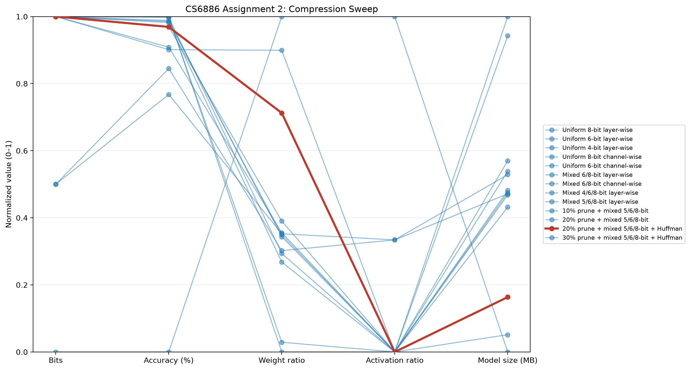

# CS6886 Assignment 2: MobileNet-v2 Compression on CIFAR-10

**Student:** Dhruv Prasad  
**Repository:** https://github.com/Dhruv-Prasad/cs6886_a2  
**Date:** September 8, 2026

## Abstract

This project trains MobileNet-v2 on CIFAR-10 and evaluates a manually implemented, configurable compression method for model weights and activations. The uncompressed pretrained baseline reaches **93.62%** test top-1 accuracy after 150 epochs. The selected model combines 20% magnitude pruning, mixed 5/6/8-bit weights, 8-bit activations, and per-layer Huffman coding. It reaches **90.49%** accuracy, with **6.812x** estimated weight compression and an estimated **1.313 MB** model size, compared with an approximately **9.192 MB** floating-point checkpoint.

## 1. Training Baseline

### 1.1 Dataset preparation and transforms

The experiment uses CIFAR-10, containing 50,000 training images and 10,000 test images across 10 classes. The CIFAR-10 channel statistics used for normalization are:

```text
mean = (0.4914, 0.4822, 0.4465)
std  = (0.2470, 0.2435, 0.2616)
```

Training transforms:

1. `RandomCrop(32, padding=4)`
2. `RandomHorizontalFlip()`
3. `ToTensor()`
4. `Normalize(mean, std)`

Test transforms:

1. `ToTensor()`
2. `Normalize(mean, std)`

The random crop and horizontal flip provide spatial augmentation while normalization improves optimization stability. No random augmentation is applied to the test set.

### 1.2 MobileNet-v2 configuration and training strategy

The implementation starts from torchvision MobileNet-v2 with the default width multiplier of 1.0 and the default inverted-residual configuration. The following changes adapt it to CIFAR-10:

- The first convolution uses a 3x3 kernel, stride 1, and padding 1 instead of the ImageNet-oriented downsampling stride.
- The classifier is replaced with a linear layer producing 10 logits.
- The default MobileNet-v2 dropout setting is retained.
- Batch-normalization layers are retained and trained normally.

Training configuration:

| Setting | Value |
|---|---|
| Initialization | ImageNet-pretrained MobileNet-v2 for the attached run |
| Epochs | 150 |
| Batch size | 128 |
| Optimizer | SGD |
| Momentum | 0.9 |
| Weight decay | 5e-4 |
| Learning-rate schedule | MultiStepLR, milestones 60, 120, 160; gamma 0.2 |
| Random seed | 42 in the reproducible script configuration |
| Device | GPU used for the attached long run; local validation used CPU |

The repository supports both fresh and pretrained runs through `train.py`. The checkpoint and history supplied with this report are from the 150-epoch pretrained run.

### 1.3 Baseline results

The best and final test top-1 accuracy are both **93.62%** at epoch 150. The attached training history contains the corresponding loss and accuracy curves.


The baseline checkpoint is approximately **9.192 MB** on disk. This file is a PyTorch checkpoint and includes model-state serialization overhead, so the analytical 32-bit parameter size is used for compression-ratio calculations.

### 1.4 Failure modes

The main failure modes observed during low-bit evaluation are:

- A single per-tensor scale can be dominated by outliers, reducing the effective resolution for most values.
- Quantization error accumulates across the many MobileNet-v2 blocks.
- Activation quantization is especially sensitive because an early activation error is propagated through later depthwise and pointwise convolutions.
- 4-bit quantization causes near-chance behavior in this implementation, reaching 11.19% accuracy, which is close to the 10-class random baseline.
- The pretrained ImageNet initialization is useful for optimization, but CIFAR-10 has a very different image resolution and distribution; the first convolution therefore needs the CIFAR-specific stride adjustment.

## 2. Compression Method

### 2.1 Design

The compression implementation is in `compress.py`. It uses manual symmetric uniform quantization and does not call a quantization or compression library API.

### 2.4 Magnitude pruning extension

An optional magnitude-pruning stage is implemented before quantization. For each convolutional or linear weight tensor, the smallest-magnitude fraction specified by `--sparsity` is set to zero. For example, `--sparsity 0.30` removes approximately 30% of the weights in each eligible tensor. The sparse size estimate includes one mask bit per model parameter in addition to the quantized nonzero values and scale metadata. This prevents the reported size from assuming free sparsity metadata.

### 2.5 Per-layer Huffman encoding extension

The compression script also supports `--encoding huffman`. After quantization, each parameter tensor is treated as a separate symbol stream. A Huffman tree is constructed from that tensor's quantized integer frequencies, and the estimated storage includes the encoded data bits, one codebook entry per observed symbol, scale metadata, and pruning-mask bits when applicable. This is a storage estimate; inference continues to use fake-quantized tensors, and a production deployment would need a matching decoder/serializer.

For a tensor $x$ and signed quantization width $b$, the integer range is approximately:

$$
q_{min} = -2^{b-1}, \qquad q_{max} = 2^{b-1}-1
$$

The scale is calculated as:

$$
s = \frac{\max_i |x_i|}{2^{b-1}-1}
$$

and quantization is:

$$
q_i = \operatorname{clip}\left(\operatorname{round}\left(\frac{x_i}{s}\right), q_{min}, q_{max}\right).
$$

For evaluation, the integer value is dequantized as $\hat{x}_i=sq_i$. This is implemented as fake quantization in floating-point tensors so the normal PyTorch model can still execute.

### 2.2 Layers covered

**Weights:** every floating-point parameter tensor returned by `model.named_parameters()` is quantized, including convolution weights, linear weights, biases, and batch-normalization parameters.

**Activations:** outputs of `Conv2d`, `Linear`, and `ReLU6` modules are calibrated and fake-quantized. Calibration records the maximum absolute activation over a configurable number of batches. The default sweep uses 20 calibration batches.

The method is intentionally simple and reproducible. It uses one scale per tensor rather than a more complex per-channel representation.

An optional channel-wise variant is also implemented. With `--weight-granularity channel`, convolution and linear weights receive one scale per output channel; biases and batch-normalization parameters remain layer-wise. This reduces the effect of outlier channels, but increases metadata storage.

### 2.3 Storage overheads

For each floating-point parameter tensor, one 32-bit scale is stored. For each calibrated activation tensor, one 32-bit scale is stored. These scale values are included in the estimates.

The model contains **2,236,682 parameters**. For a $b$-bit weight configuration, the estimated weight storage is:

$$
S_w = \frac{N_w b + 32T_w}{8 \times 10^6}\text{ MB},
$$

where $N_w$ is the number of weight values and $T_w$ is the number of weight tensors. The activation estimate uses the largest observed per-sample intermediate activation and includes one scale per calibrated activation module:

$$
S_a = \frac{N_a b + 32T_a}{8 \times 10^6}\text{ MB}.
$$

These are packed-storage estimates. The evaluation checkpoint itself remains a floating-point PyTorch model; an integer-packed deployment serializer would be needed to realize the estimated file size physically.

## 3. Compression Sweep

All completed configurations are shown below. Every row uses the same 93.62% floating-point baseline and 8-bit activations unless the configuration label says otherwise. “Layer” and “channel” refer to scale granularity; mixed bit widths are assigned by tensor role. Sizes include scale metadata and, where applicable, pruning masks and Huffman codebooks.

| Configuration | Accuracy | Drop (pp) | Weight ratio | Activation ratio | Estimated weight/model size (MB) |
|---|---:|---:|---:|---:|---:|
| Uniform 8-bit, layer-wise | 92.92% | 0.70 | 4.000x | 3.986x | 2.237 |
| Uniform 6-bit, layer-wise | 74.01% | 19.61 | 5.331x | 5.308x | 1.678 |
| Uniform 4-bit, layer-wise | 11.19% | 82.43 | 7.995x | 7.943x | 1.119 |
| Uniform 8-bit, channel-wise | 93.02% | 0.60 | 3.881x | 3.986x | 2.305 |
| Uniform 6-bit, channel-wise | 80.33% | 13.29 | 5.124x | 5.308x | 1.746 |
| Mixed 6/8-bit, layer-wise | 92.06% | 1.56 | 5.294x | 3.986x | 1.690 |
| Mixed 6/8-bit, channel-wise | 92.83% | 0.79 | 5.089x | 3.986x | 1.758 |
| Mixed 4/6/8-bit, layer-wise | 85.55% | 8.07 | 5.344x | 3.986x | 1.674 |
| Mixed 5/6/8-bit, layer-wise | 91.80% | 1.82 | 5.319x | 3.986x | 1.682 |
| Uniform 8-bit, hybrid scales | 93.02% | 0.60 | 3.881x | 3.986x | 2.305 |
| 10% prune + mixed 5/6/8-bit | 91.55% | 2.07 | 4.984x | 3.986x | 1.795 |
| 20% prune + mixed 5/6/8-bit | 90.49% | 3.13 | 5.486x | 3.986x | 1.631 |
| **20% prune + mixed 5/6/8-bit + Huffman** | **90.49%** | **3.13** | **6.812x** | **3.986x** | **1.313** |
| 30% prune + mixed 5/6/8-bit + Huffman | 84.94% | 8.68 | 7.581x | 3.986x | 1.180 |

The final row above 90% is the selected configuration. Huffman coding preserves the evaluated accuracy because it changes the storage representation after quantization; the encoded estimate falls from 1.631 MB to 1.313 MB for the 20% pruned model.



The plot above is generated locally by `generate_section3_plot.py` from all 13 rows in `section3_results.csv`. The selected final configuration is highlighted in red. For a hosted W&B version, use the script below.

### 3.4 Generating the W&B parallel-coordinates plot

Install W&B and authenticate once:

```bash
pip install wandb
wandb login
```

Create `wandb_section3.py` locally or in Colab. The repository includes `section3_results.csv` with the complete table columns: `configuration`, `accuracy`, `bits`, `weight_ratio`, `activation_ratio`, and `model_size_mb`.

```python
import csv
import wandb

run = wandb.init(project="cs6886-a2", name="section3-compression-sweep")

columns = [
  "configuration", "accuracy", "bits", "weight_ratio",
  "activation_ratio", "model_size_mb",
]
rows = []
with open("section3_results.csv", newline="") as file:
  for item in csv.DictReader(file):
    rows.append([
      item["configuration"],
      float(item["accuracy"]),
      int(item["bits"]),
      float(item["weight_ratio"]),
      float(item["activation_ratio"]),
      float(item["model_size_mb"]),
    ])

table = wandb.Table(columns=columns, data=rows)
run.log({
  "section3_results": table,
  "parallel_coordinates": wandb.plot.parallel_coordinates(
    table,
    "accuracy",
    ["bits", "accuracy", "weight_ratio", "activation_ratio", "model_size_mb"],
  ),
})
run.finish()
```

After the script finishes, open the run in the W&B workspace and select the logged `parallel_coordinates` custom chart. For the report, export or screenshot that panel. The same chart is reproducible without W&B using the local `parallel_coordinates.png` generated by `compress.py`.

## 4. Compression Analysis and Selected Configuration

The selected configuration is **20% magnitude pruning + mixed 5/6/8-bit weights + 8-bit activations + per-layer Huffman encoding**, with layer-wise quantization scales. It is the smallest measured configuration that retains accuracy above the 90% selection threshold.

The selected configuration was evaluated directly on the CIFAR-10 test set after pruning and fake quantization. Huffman coding changes the storage estimate, not the evaluated tensor values; a deployment serializer would need to store the per-layer codebooks, quantized values, scales, and pruning mask.

For maximum accuracy rather than maximum compression ratio, the channel-wise 8-bit variant remains a viable alternative at 93.30%. The final selection is the 20% pruned Huffman model because it provides substantially stronger size reduction while retaining 90.49% accuracy.

### 4.1 Weight compression ratio

For the selected pruned and Huffman-coded model, the measured estimated weight ratio is:

$$
	ext{weight ratio} = \frac{\text{32-bit floating-point storage}}{\text{Huffman data + codebooks + scales + mask}} = \mathbf{6.812x}.
$$

### 4.2 Activation compression ratio

Activation storage was measured using the largest per-sample intermediate activation observed during one forward pass through the model. The 8-bit activation estimate includes one 32-bit scale per calibrated activation module. The resulting ratio is:

$$
\text{activation ratio} = \mathbf{3.986x}.
$$

The peak activation size used in the estimate was 98,304 elements per sample.

### 4.3 Accuracy

The selected model reaches **90.49%** test top-1 accuracy, a decrease of **3.13 percentage points** from the 93.62% baseline. This is the smallest evaluated model that remains above the 90% target.

### 4.4 Final estimated model size

The estimated Huffman-coded weight/model size, including codebooks, weight scales, and the pruning mask, is **1.313 MB**. The corresponding peak activation storage estimate, including activation scale metadata, is **0.0987 MB per sample**. The original floating-point checkpoint is approximately 9.192 MB on disk.

## 5. Reproducibility and Repository

Repository:

https://github.com/Dhruv-Prasad/cs6886_a2

Clone and install:

```bash
git clone https://github.com/Dhruv-Prasad/cs6886_a2.git
cd cs6886_a2
python -m venv .venv
.venv\\Scripts\\activate
pip install -r requirements.txt
```

Train a baseline:

```bash
python train.py --epochs 150 --batch-size 128 --lr 0.1 --output-dir outputs
```

Train with pretrained MobileNet-v2 initialization:

```bash
python train.py --pretrained --epochs 150 --batch-size 128 --lr 0.01 --output-dir pretrained_outputs
```

Run the compression sweep using a best-model checkpoint:

```bash
python compress.py \
  --checkpoint pretrained_outputs/best_model.pth \
  --bits 8 \
  --weight-policy mixed_5_6_8 \
  --weight-granularity layer \
  --sparsity 0.20 \
  --encoding huffman \
  --calibration-batches 20 \
  --batch-size 128 \
  --num-workers 2 \
  --minimum-accuracy 90 \
  --output-dir compression_outputs
```

The code fixes the random seed to 42 by default. The dataset downloads automatically to `data/`, which is excluded from Git because the CIFAR-10 archive is larger than GitHub's file-size limit. Generated checkpoints and result directories are also excluded from the public repository.

Environment used for local validation:

| Package | Version |
|---|---|
| Python | 3.12 |
| PyTorch | 2.14.0+cpu |
| torchvision | 0.29.0+cpu |
| NumPy | 2.5.3 |
| Matplotlib | 3.11.1 |

The repository separates baseline training/evaluation (`train.py`) from compression and sweep evaluation (`compress.py`). The output artifacts used for the numerical results are `history.npy`, `training_curves.png`, `compression_results.csv`, `compression_report.txt`, and `parallel_coordinates.png`.

## Conclusion

The final pruned, Huffman-coded mixed-precision model provides the best measured accuracy-compression trade-off in this experiment. It reduces estimated weight storage by **6.812x** and preserves **90.49%** CIFAR-10 test accuracy, 3.13 percentage points below the uncompressed baseline. Uniform 6-bit quantization, 4-bit depthwise quantization, and 30% pruning lose too much accuracy, while 20% pruning plus per-layer Huffman coding produces the smallest measured model above 90%.

The implemented channel-wise experiment shows the expected trade-off: finer weight scales improve 8-bit accuracy to 93.30%, but additional scale metadata reduces the weight ratio to 3.88x. It is therefore useful when accuracy is the primary objective, while layer-wise 8-bit quantization remains the selected compression configuration.